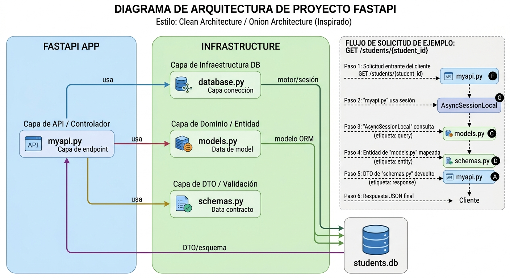
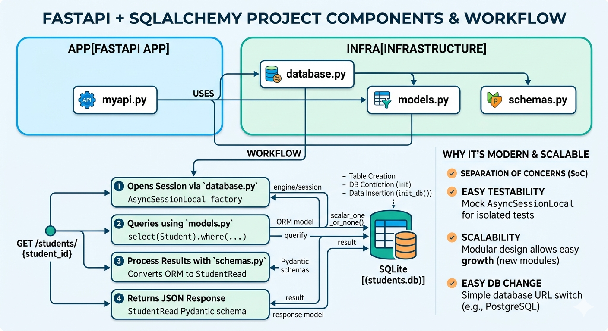

# TestFastAPI (FastAPI + SQLAlchemy Async + SQLite)

Proyecto de ejemplo que muestra una arquitectura modular y clara para FastAPI con base de datos SQLite usando SQLAlchemy async.

## Estructura de archivos

- `myapi.py` - API principal y rutas. Maneja el ciclo de vida y endpoints REST.
- `database.py` - Configuración de SQLAlchemy, engine async y `init_db()`.
- `models.py` - Modelo ORM `Student`.
- `schemas.py` - Esquema Pydantic `StudentRead` para respuestas.

## Dependencias

- Python 3.14
- fastapi
- uvicorn
- sqlalchemy
- aiosqlite
- pydantic

Instalación:

```bash
cd c:\Users\Sanch\Desktop\Projekte\Test\TestFastAPI
c:/Users/Sanch/Desktop/Projekte/Test/Gen_AI/venv/Scripts/python.exe -m pip install fastapi uvicorn sqlalchemy aiosqlite pydantic
```

## Ejecución

```bash
cd c:\Users\Sanch\Desktop\Projekte\Test\TestFastAPI
c:/Users/Sanch/Desktop/Projekte/Test/Gen_AI/venv/Scripts/python.exe -m uvicorn myapi:app --reload
```

Accede a:
- http://127.0.0.1:8000/students/1
- http://127.0.0.1:8000/students/2
- http://127.0.0.1:8000/students/3 (404)

## Flujo y ciclo de vida

1. `myapi.py` usa `lifespan` con `init_db()` de `database.py` para inicializar DB en startup.
2. `database.py`:
   - Crea `engine` async y `AsyncSessionLocal`.
   - Crea tabla `students` y datos semilla con `init_db()`.
3. `models.py` define el modelo `Student`.
4. `schemas.py` define `StudentRead` y `orm_mode` para serializar objetos ORM.
5. `myapi.py`:
   - Endpoint `GET /students/{student_id}`
   - Usa sesión async para query `Student` y retorna `StudentRead`.

## Arquitectura recomendada con separación de capas

1. `routers/students.py` (handlers de rutas)
2. `services/student_service.py` (lógica del negocio)
3. `repositories/student_repo.py` (consultas DB)
4. `database.py` (infraestructura DB)
5. `models.py` (ORM)
6. `schemas.py` (DTO)

## Testing básico

- Unit tests con `pytest` y `sqlite+aiosqlite:///:memory:` para evitar usar disco.
- Verificar endpoint por request con `httpx`.

```python
import pytest
from httpx import AsyncClient
from myapi import app

@pytest.mark.asyncio
async def test_get_student_1():
    async with AsyncClient(app=app, base_url="http://test") as client:
        r = await client.get("/students/1")
        assert r.status_code == 200
        assert r.json()["name"] == "Alice"
```

---

## Diagrama de Arquitectura

Se incluye un diagrama detallado en `Docs/Components_workflow.png` y `Docs/Arquitecture.png`. Revisa el archivo para la visualización completa.

### Arquitectura


Este diagrama representa una arquitectura **basada en capas** (inspirada en *Clean Architecture* u *Onion Architecture*). La idea central es que el código no sea un "espagueti" donde todo está mezclado, sino que cada archivo tenga una misión única y sagrada.

---

## 🧩 Desglose de los Componentes

### 1. `myapi.py` (La Capa de Entrada / Controlador)
Es el "portero" de tu aplicación. Su único trabajo es recibir peticiones HTTP, llamar a las funciones correctas y devolver una respuesta.
*   **No sabe** cómo se guardan los datos en la base de datos.
*   **Solo sabe** que necesita una "sesión" y que debe devolver un JSON válido.

### 2. `database.py` (La Infraestructura / Fontanería)
Aquí reside la configuración técnica. Define cómo nos conectamos al mundo exterior (en este caso, SQLite).
*   Configura el `engine` y el `AsyncSessionLocal`.
*   Es el lugar donde decides si usas PostgreSQL, MySQL o una simple base de datos en memoria.

### 3. `models.py` (El Dominio / Entidades ORM)
Es la representación de tus tablas en código Python. Es el lenguaje que entiende **SQLAlchemy**.
*   Define que un "Estudiante" tiene un nombre (string) y una edad (integer).
*   Es el puente entre tu código y las filas de la base de datos.

### 4. `schemas.py` (El Contrato / DTO)
Aquí es donde **Pydantic** brilla. Mientras que los `models` son para la DB, los `schemas` son para el cliente (el navegador o la app móvil).
*   **Validación:** Se asegura de que, si pides un ID, sea un número y no un texto.
*   **Filtrado:** Permite ocultar datos sensibles (como contraseñas) para que no salgan en la respuesta JSON.

---

## 🚀 ¿Por qué es útil esta arquitectura?

Utilizar este enfoque no es por capricho estético; tiene beneficios prácticos muy claros:


### 1. Separación de Responsabilidades (SoC)
Si tienes un error en la validación de datos, vas directo a `schemas.py`. Si la base de datos no conecta, vas a `database.py`. No tienes que rebuscar en un archivo de 2,000 líneas de código para encontrar el problema.

### 2. Facilidad de Testing
Como las capas están separadas, puedes probar la lógica de tus rutas en `myapi.py` usando una base de datos de prueba (mocking) sin afectar tus datos reales. Es mucho más sencillo aislar componentes.

### 3. Intercambiabilidad (Mantenimiento a largo plazo)
Imagina que hoy usas SQLite, pero mañana tu app es un éxito y necesitas **PostgreSQL**. 
*   **En una mala arquitectura:** Tendrías que cambiar código en todos tus archivos.
*   **En esta arquitectura:** Solo cambias la URL de conexión en `database.py` y quizás algún detalle menor en `models.py`. El resto de la app ni se entera del cambio.

### 4. Escalabilidad
Cuando necesites agregar "Profesores", "Cursos" o "Calificaciones", simplemente sigues el patrón: creas su modelo, su esquema y su ruta. El proyecto crece de forma organizada y predecible, evitando el código redundante.

> **En resumen:** Esta arquitectura separa **qué** hace tu aplicación (negocio/modelos) de **cómo** lo hace (infraestructura/DB) y de **cómo** se muestra (API/schemas). Es la diferencia entre un cajón de sastre y una caja de herramientas profesional.

---
## Flujo de componentes:



- **Estructura del Proyecto**: En la parte superior, verás los dos grandes subgrafos: `APP[FASTAPI APP]` (que contiene `myapi.py`) e `INFRA[INFRASTRUCTURE]` (que contiene `database.py`, `models.py` y `schemas.py`). Las flechas `USES` muestran cómo la aplicación principal interactúa con cada componente de la infraestructura.

- **El Flujo de Trabajo**: En la parte inferior, se desglosa el flujo paso a paso de una solicitud `GET /students/{student_id}`:

  1. `myapi.py` utiliza `database.py` para abrir una sesión (`AsyncSessionLocal` factory).
  2. Se ejecuta una consulta (`select(Student)`) utilizando el modelo ORM definido en `models.py` contra la base de datos SQLite (`students.db`).
  3. El resultado ORM crudo se procesa y valida utilizando los esquemas Pydantic definidos en `schemas.py` (convirtiéndolo en `StudentRead`).
  4. Se devuelve la respuesta final en formato JSON limpio a la API.

- **Ventajas de la Arquitectura**: En el panel lateral derecho, se resumen los puntos clave que mencionaste sobre por qué este diseño es moderno y escalable, incluyendo la Separación de Responsabilidades, Testabilidad Fácil, Escalabilidad y la Facilidad para Cambiar de Base de Datos.

---

¡Listo! Con esto tienes una guía detallada para entender y mantener la arquitectura moderna del proyecto.